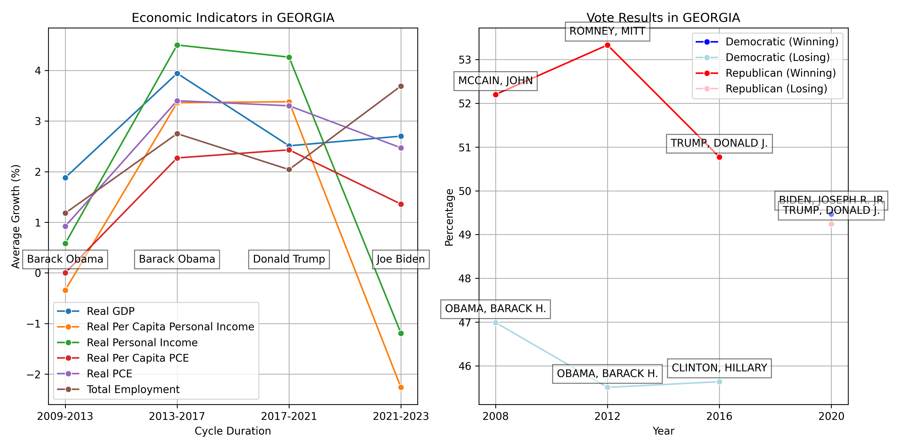
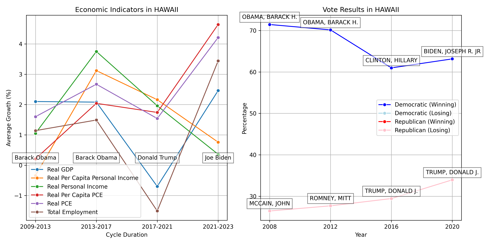
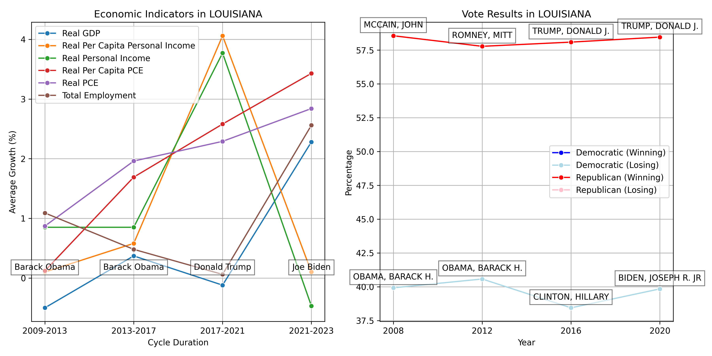

## Alabama

## Alaska

## Arizona

## Arkansas

## California

## Colorado

## Connecticut

## Delaware

## District Of Columbia

## Florida

## Georgia

## Hawaii

## Idaho

## Illinois

## Indiana

## Iowa

## Kansas

## Kentucky

## Louisiana

## Maine

## Maryland

## Massachusetts

## Michigan

## Minnesota

## Mississippi

## Missouri

## Montana

## Nebraska

## Nevada

## New Hampshire

## New Jersey

## New Mexico

## New York

## North Carolina

## North Dakota

## Ohio

## Oklahoma

## Oregon

## Pennsylvania

## Rhode Island

## South Carolina

## South Dakota

## Tennessee

## United States

